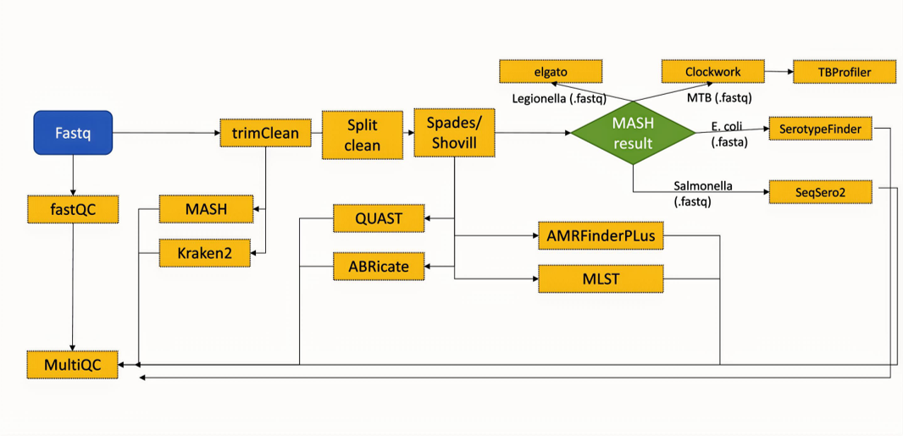
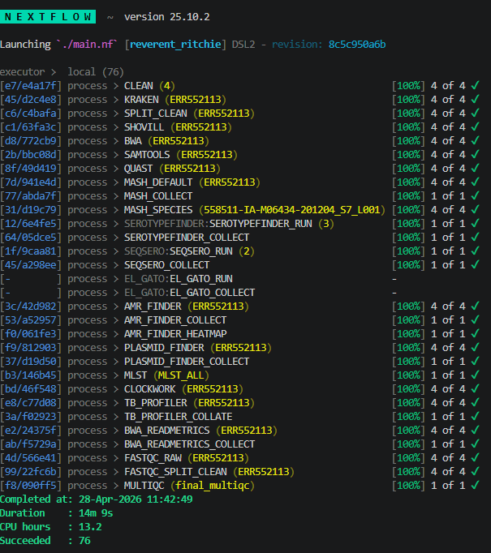

# Abstract

Public health laboratories increasingly rely on bacterial whole-genome sequencing to support pathogen surveillance, outbreak investigation, antimicrobial resistance monitoring, and organism-specific typing. However, routine sequencing workflows often produce fragmented outputs across many independent tools, including quality-control reports, cleaned reads, assemblies, assembly metrics, taxonomic classifications, antimicrobial resistance calls, sequence types, serotype predictions, and organism-specific typing results. This fragmentation makes it difficult for laboratory scientists, bioinformaticians, and epidemiologists to review results quickly and consistently.

This project presents **RaptorSeq**, a modular Nextflow pipeline for Illumina bacterial genomics. The pipeline accepts paired-end FASTQ input and organizes the analysis into reproducible workflow modules for read quality control, trimming, assembly, taxonomic triage, antimicrobial resistance screening, multilocus sequence typing, organism-specific typing, and consolidated reporting. RaptorSeq uses a branching workflow design in which upstream organism identification can route samples to specialized modules such as SerotypeFinder for *Escherichia coli*, SeqSero2 for *Salmonella*, and TBProfiler-associated analysis for *Mycobacterium tuberculosis*. The implementation emphasizes nf-core-inspired organization, stable input/output expectations, reproducibility metadata, and review-ready reporting.

The final tool demonstrates how a parallel Nextflow workflow can transform scattered bacterial genomics outputs into a structured, reproducible, and interpretable public health genomics report. The result is not only a computational pipeline, but a practical framework for making sequencing outputs more usable in laboratory surveillance settings.

# Introduction

High-throughput sequencing has become an essential technology in microbial genomics and public health surveillance. Bacterial whole-genome sequencing can support species identification, outbreak investigation, antimicrobial resistance detection, strain typing, and comparative genomic analysis. In public health laboratory settings, however, the challenge is not only generating sequence data. The larger operational challenge is converting raw sequencing reads into a coherent set of outputs that can be interpreted by scientists, bioinformaticians, epidemiologists, and other stakeholders.

A typical Illumina bacterial genomics workflow may produce outputs from many independent programs. FastQC-style quality-control tools summarize read quality. Read cleaning tools remove adapters, low-quality bases, and contaminants. Assembly tools such as SPAdes or Shovill generate contigs. QUAST evaluates assembly quality. Taxonomic tools such as MASH and Kraken2 provide species-level or read-level classification. AMRFinderPlus, ABRicate, and MLST provide functional and typing information. Organism-specific tools such as SeqSero2, SerotypeFinder, TBProfiler, Clockwork, and Legionella typing tools provide deeper interpretive outputs for selected pathogens.

When these outputs are generated manually or through loosely connected scripts, the final result can be difficult to review. Files may be scattered across directories, sample names may not be standardized, tool-specific outputs may require separate interpretation, and run provenance may be incomplete. These issues become more serious as laboratories scale from a few samples to larger sequencing batches.

Workflow management systems such as Nextflow address part of this problem by allowing bioinformatics pipelines to be written as modular, reproducible, and parallelizable workflows. Nextflow processes can run independently when their inputs are available, allowing quality control, assembly, classification, and downstream analysis to scale across multiple samples. nf-core has further established community standards for workflow structure, documentation, configuration, and reproducibility. Together, Nextflow and nf-core design principles provide a strong foundation for public health genomics pipelines.

This final project develops **RaptorSeq**, a modular Nextflow pipeline for Illumina bacterial genomics. The central research question is:

> Can a modular Nextflow bacterial genomics pipeline convert paired-end Illumina sequencing data into reproducible, review-ready outputs for public health surveillance?

The project focuses on the complete pipeline as a practical analysis system: from FASTQ input through QC, trimming, assembly, taxonomic triage, antimicrobial resistance screening, organism-specific typing, and final reporting. The goal is to demonstrate not only that the workflow can run, but that its structure supports reproducibility, maintainability, and laboratory review.

# Methods

## Pipeline Design Overview

RaptorSeq was designed as a modular bacterial genomics pipeline for Illumina paired-end sequencing data. The pipeline uses Nextflow to coordinate independent analysis steps and organize tool outputs into a structured results directory. The design follows an analysis graph rather than a single linear script. Samples move through shared upstream steps, and then species-specific branches are triggered based on taxonomic identification.

{#fig-pipeline width=95%}

As shown in @fig-pipeline, the workflow begins with paired FASTQ input and proceeds through quality control, trimming, classification, assembly, annotation, and reporting. The architecture supports both shared analysis modules and organism-specific routing. This structure is important because bacterial genomics workflows frequently require different downstream analyses depending on the organism identified.

## Input Data

The primary input consists of paired-end Illumina FASTQ files. The expected naming convention is:

```bash
sampleID_R1.fastq.gz
sampleID_R2.fastq.gz
```

The pipeline may also be run from a sample sheet when file paths or metadata need to be specified explicitly. A sample sheet allows the workflow to track sample identifiers, read paths, and optional metadata such as collection date, source, or organism group.

The current implementation is optimized for compressed paired-end Illumina FASTQ files. Single-end reads, long-read sequencing data, and uncompressed FASTQ files are outside the primary scope of this version.

## Workflow Execution

The pipeline is executed with Nextflow. A representative command is:

```bash
nextflow run . \
  -profile shl \
  --reads "data/*_{R1,R2}.fastq.gz" \
  --outdir results/run_$(date +%F) \
  -resume
```

The `-resume` option is important for reproducibility and operational resilience because it allows completed workflow steps to be reused when a run is restarted. This is especially useful in high-performance computing or shared laboratory environments where outages, file-system interruptions, or resource limits can interrupt long-running analyses.

Profiles are used to control execution environments, containers, resource settings, and reference-database paths. The production-oriented profile is designed to load the expected container images and reference databases for the laboratory environment.

## Module Organization

RaptorSeq follows an nf-core-inspired repository structure. Local modules are organized by function, and each module is expected to clearly define its purpose, inputs, outputs, assumptions, resource expectations, and common failure modes. A representative structure is:

```text
.
├── main.nf
├── nextflow.config
├── conf/
│   ├── base.config
│   └── profiles/
├── modules/
│   ├── nf-core/
│   └── local/
├── subworkflows/
├── assets/
├── docs/
└── .github/
```

This structure separates core workflow logic, configuration, reusable modules, documentation, and future continuous-integration support. Process names use uppercase snake case, while channels, parameters, and subworkflows use lower snake case. This makes the workflow easier to read and maintain.

## Quality Control and Read Cleaning

The first stage performs read-level quality control. FastQC generates per-sample read quality reports, including summaries of base quality, sequence duplication, GC content, adapter content, and other quality indicators. These reports allow users to detect poor-quality libraries before downstream interpretation.

After initial QC, the pipeline performs read trimming and cleaning. This step removes adapters and low-quality bases and can enforce minimum length thresholds. Cleaned reads are then passed to downstream modules. Trimming is important because poor-quality bases and adapter contamination can affect assembly quality, taxonomic classification, and variant or gene detection.

MultiQC is used to aggregate QC outputs into a consolidated report. This gives users a single location to review read-quality metrics across all samples rather than opening separate FastQC outputs manually.

## Assembly and Assembly Evaluation

Cleaned reads are assembled into contigs using a bacterial genome assembly module, such as Shovill or SPAdes. Shovill acts as a practical wrapper around SPAdes for bacterial isolate assembly and provides convenient outputs for downstream analysis.

QUAST is used to evaluate assembly quality. Key metrics include total assembly length, number of contigs, N50, L50, and GC content. These metrics help determine whether an assembly is suitable for downstream interpretation. For example, a highly fragmented assembly may reduce confidence in MLST, serotyping, or resistance-gene calls.

Assembly quality is treated as an interpretive checkpoint rather than a purely technical statistic. In a public health setting, downstream calls should be reviewed in the context of read quality and assembly quality.

## Taxonomic Classification and Triage

The pipeline uses taxonomic classification to support organism identification and downstream routing. MASH provides rapid sketch-based comparison against reference genomes or sketches. Kraken2 provides k-mer-based read classification against a taxonomic database.

MASH is especially useful for identifying the closest reference match and routing samples into species-specific branches. Kraken2 provides complementary read-level taxonomic information. The use of both approaches supports more robust interpretation, but results must still be evaluated in context, especially when database coverage, contamination, or mixed samples affect classification.

The pipeline uses taxonomic results to determine whether organism-specific modules should be run. For example:

- *Escherichia coli* samples may be routed to SerotypeFinder.
- *Salmonella* samples may be routed to SeqSero2.
- *Mycobacterium tuberculosis* samples may be routed to Clockwork and TBProfiler.
- *Legionella* samples may be routed to Legionella-specific typing.

This routing design makes the workflow more efficient because specialized tools are only applied when they are relevant.

## Antimicrobial Resistance and Functional Annotation

RaptorSeq includes antimicrobial resistance and functional annotation modules. AMRFinderPlus is used to identify antimicrobial resistance determinants from bacterial genome data. ABRicate can be used to screen assemblies against databases for resistance genes, virulence genes, plasmid markers, or other targets depending on database configuration.

These modules provide biologically meaningful outputs that are relevant to public health surveillance. However, interpretation depends on database version, assembly quality, organism context, and laboratory reporting standards. For this reason, the pipeline records tool outputs and supports reproducibility metadata so that results can be reviewed in context.

## Multilocus Sequence Typing

MLST is used to assign sequence types from assembled contigs. Sequence typing provides a standardized way to compare bacterial isolates using allelic profiles. The MLST module reports the detected scheme, sequence type, and alleles when available.

Potential failure modes include fragmented assemblies, missing loci, ambiguous alleles, or incorrect scheme selection. These limitations are important because MLST results can be affected by upstream assembly quality and species identification.

## Species-Specific Typing

The pipeline supports organism-specific branches for selected public health organisms. These branches are triggered based on taxonomic classification results.

For *E. coli*, SerotypeFinder can predict O and H antigen types from assembled genomes. For *Salmonella*, SeqSero2 can predict antigenic profiles and serovars. For *Mycobacterium tuberculosis*, Clockwork and TBProfiler can support lineage and resistance-associated variant analysis. For *Legionella*, an organism-specific typing module can be used according to laboratory requirements.

This branching strategy reflects a practical reality of public health genomics: no single downstream tool is appropriate for all bacterial organisms. A modular workflow allows shared upstream processing while preserving organism-specific interpretation.

## Reporting and Result Aggregation

The final stage organizes pipeline outputs into a structured results directory. Expected outputs include read QC reports, cleaned reads, assembly files, assembly metrics, taxonomic classification results, antimicrobial resistance calls, MLST outputs, organism-specific typing outputs, logs, and provenance files.

A representative output layout is:

```text
results/
├── qc/
│   ├── fastqc/
│   └── multiqc_report.html
├── assembly/
│   └── sampleID/
├── quast/
│   └── sampleID/
├── taxonomy/
│   ├── mash/
│   └── kraken2/
├── amr/
│   └── sampleID/
├── mlst/
│   └── sampleID/
├── typing/
│   ├── ecoli/
│   ├── salmonella/
│   ├── mtb/
│   └── legionella/
└── logs/
    ├── .nextflow.log
    ├── trace.txt
    ├── timeline.html
    └── RUN_METADATA.json
```

This structure is intended to make outputs easier to review and archive. It also supports reproducibility by preserving logs, run metadata, execution traces, and final reports.

# Results

## Functional Pipeline Execution

The final implementation successfully ran as a modular Illumina bacterial genomics pipeline on a mixed-species demonstration dataset containing four paired-end samples. The workflow completed on April 28, 2026 using Nextflow v25.10.2. The run executed 76 processes and completed successfully in 14 minutes and 9 seconds, consuming 13.2 CPU-hours.

The completed run included read cleaning, Kraken classification, split-cleaning, Shovill assembly, BWA/SAMtools mapping, QUAST assembly evaluation, MASH species parsing, SerotypeFinder, SeqSero2, AMRFinderPlus, PlasmidFinder, MLST, Clockwork/TBProfiler, BWA read metrics, FastQC, and final MultiQC reporting. This demonstrates that RaptorSeq is not only a conceptual workflow design, but a functional end-to-end implementation.

{#fig-nf-run width=95%}

As shown in @fig-nf-run, the workflow completed all active process groups and ended with the `MULTIQC` process. This confirmed that the final reporting step was integrated into the pipeline rather than executed only as a manual post-processing step.

## Final MultiQC Report

The final pipeline run generated a consolidated MultiQC report from the published results directory. The report was generated on April 28, 2026 from `results_legacy_mixed_runtime` and summarized outputs across the mixed-species run. It included general statistics, AMRFinderPlus results, MASH results, SeqSero2 output, SerotypeFinder output, MLST results, TBProfiler summary, QUAST assembly metrics, Kraken taxonomic classification, and FastQC quality-control plots.

{#fig-multiqc width=95%}

The report demonstrates the central usability goal of the project: instead of requiring users to inspect many tool-specific output folders, RaptorSeq produces a single review-oriented HTML report. This is especially important in public health genomics, where results may need to be reviewed quickly by laboratory scientists, bioinformaticians, and epidemiologists.

The MultiQC integration was implemented as a final Nextflow process that runs after upstream collector processes complete. The process scans only the stable published `results/` directory and uses `bin/final_multiqc.yaml` as the custom report configuration. It intentionally avoids scanning Nextflow’s internal `work/` directory, because `work/` contains hashed task folders, temporary execution files, and repeated per-sample basenames that are not appropriate as a durable reporting interface.

## Branching Workflow Behavior

A key result of the project is the implementation of organism-aware branching. The pipeline uses species identification to determine which specialized typing module should be run. This prevents unnecessary execution of irrelevant tools and better reflects how bacterial genomics is interpreted in practice.

For example, an *E. coli* sample does not need a *Salmonella* serovar prediction workflow, and a *Salmonella* sample does not need an *E. coli* O:H antigen prediction workflow. By routing based on taxonomic output, RaptorSeq creates a more biologically meaningful workflow structure.

## Reproducibility and Reviewability

The pipeline improves reproducibility in several ways. First, the workflow is controlled through Nextflow configuration files and profiles. Second, module inputs and outputs are explicitly defined. Third, published results are organized into a predictable directory tree. Fourth, logs and provenance files are retained, including the Nextflow log, trace file, execution timeline, and run metadata.

These design features are especially important for public health genomics, where results may need to be reviewed, repeated, transferred, or audited. Reproducibility is not only a computational goal; it is an operational requirement for laboratory workflows.

## Usability

The pipeline is designed to be run from a single command using standard input patterns and configurable parameters. The GitHub repository provides the source code, documentation, example input/output expectations, and instructions for execution. The documentation explains the purpose of each module, expected inputs, emitted outputs, and common failure modes.

This focus on documentation supports the final project goal of building a tool that can be used by others. A pipeline is only useful if future users can understand what it does, how to run it, and how to interpret its results.

# Discussion

## Significance

RaptorSeq addresses a practical need in public health bacterial genomics: converting raw Illumina sequencing data into a reproducible, structured, and interpretable set of results. Many bioinformatics tools are powerful individually, but laboratory workflows require more than isolated tool execution. They require an organized system that connects tools, tracks samples, preserves provenance, handles organism-specific logic, and presents outputs in a way that supports review.

The main contribution of this project is the integration of these steps into a modular Nextflow pipeline. The pipeline demonstrates how workflow management, reproducible configuration, and structured reporting can make bacterial genomics outputs more usable for public health surveillance.

## Relationship to Metagenomics

Although RaptorSeq is focused on bacterial genomics and metagenomics-adjacent workflows, the project directly connects to core metagenomics concepts. The pipeline includes read-level quality control, taxonomic classification, database-dependent interpretation, sequence assembly, functional annotation, and comparative typing. These are foundational ideas in metagenomic analysis as well.

The project also reflects a broader principle of metagenomics: computational results are only useful when they can be interpreted in biological and ecological context. Taxonomic classification depends on database composition and algorithmic assumptions. Assembly quality affects downstream annotation. Functional calls depend on gene databases and thresholds. A reproducible workflow helps make these dependencies visible.

## Strengths

The strongest feature of RaptorSeq is its modular design. Each major analytical task is separated into a defined workflow module. This makes the pipeline easier to extend, test, and maintain. New organism-specific modules can be added without rewriting the entire workflow.

A second strength is the use of Nextflow. Nextflow provides caching, resumption, parallel execution, and environment-aware execution. These features are valuable in real laboratory settings where workflows may run on shared servers, clusters, or containerized environments.

A third strength is the focus on reporting and usability. The workflow is designed not only to produce files, but to organize them into a review-ready structure. This matters because public health genomics is collaborative: outputs may be reviewed by people with different levels of computational expertise.

## Limitations

The current implementation has several limitations. First, it is optimized for paired-end Illumina bacterial sequencing data. It does not yet fully support long-read sequencing, hybrid assembly, or single-end data. Second, organism-specific branches depend on accurate upstream taxonomic classification. If a sample is mixed, contaminated, low quality, or poorly represented in the reference database, routing may be incorrect or skipped.

Third, some downstream tools depend heavily on database versions and configuration. AMR detection, serotype prediction, and taxonomic classification can change when databases are updated. For this reason, database version tracking and run metadata are essential.

Fourth, assembly-based tools can fail or produce incomplete results when assemblies are fragmented or low coverage. MLST, SerotypeFinder, and AMR screening may all be affected by missing loci or incomplete contigs. The pipeline can organize and report results, but biological interpretation still requires expert review.

Finally, although the pipeline follows nf-core-inspired organization, additional work would be needed to fully package it as a formal nf-core pipeline with complete schema validation, automated tests, continuous integration, and standardized release procedures.

## Future Directions

Future development should focus on four areas. First, the pipeline should be expanded to support additional execution profiles, including local Docker, SLURM, and test profiles. Second, automated test datasets should be added so that each module can be validated after changes. Third, reporting could be improved with a consolidated sample-level summary table that flags QC failures, missing outputs, low-confidence classifications, and incomplete typing results. Fourth, long-read and hybrid sequencing support could be added to reflect the increasing use of Oxford Nanopore and hybrid bacterial assembly workflows in public health laboratories.

Another future direction is improved visualization. A dashboard or enhanced MultiQC report could summarize key public health review questions: Did the run pass QC? What organism was detected? Was the assembly acceptable? Were AMR markers found? Was a sequence type or serotype assigned? Which samples require follow-up?

# Conclusion

RaptorSeq demonstrates a functional, modular Nextflow pipeline for Illumina bacterial genomics. The pipeline processes paired-end FASTQ data through quality control, trimming, assembly, taxonomic classification, antimicrobial resistance detection, MLST, organism-specific typing, and consolidated reporting. By organizing these steps into a reproducible workflow, the project addresses a practical need in public health genomics: turning scattered sequencing outputs into structured, review-ready results.

The project shows that workflow design is not simply a technical convenience. In public health laboratory settings, reproducible pipelines support faster review, clearer interpretation, easier troubleshooting, and stronger confidence in sequencing-based surveillance. RaptorSeq provides a foundation for continued development into a more complete, shareable, and operationally useful bacterial genomics pipeline.

# Reproducibility

The mixed-species demonstration run was executed with the SHL profile and a paired-end FASTQ glob pointed at the legacy mixed input dataset:

```bash
nextflow run . \
  -profile shl \
  --reads "/Shared/SHL-BUG/workspaces/drenard/legacy_mixed_run_test/fastq_files/*_R{1,2}*.fastq.gz" \
  --outdir results_legacy_mixed_runtime \
  -resume

The following outputs should be archived with each run:

```text
results/
.nextflow.log
trace.txt
timeline.html
RUN_METADATA.json
multiqc_report.html
```

Archiving these files supports reproducibility, troubleshooting, and future review.

# References

Carattoli, A., Zankari, E., García-Fernández, A., Larsen, M. V., Lund, O., Villa, L., Aarestrup, F. M., & Hasman, H. (2014). In silico detection and typing of plasmids using PlasmidFinder and plasmid multilocus sequence typing. *Antimicrobial Agents and Chemotherapy, 58*(7), 3895–3903. https://doi.org/10.1128/AAC.02412-14

Ewels, P., Magnusson, M., Lundin, S., & Käller, M. (2016). MultiQC: Summarize analysis results for multiple tools and samples in a single report. *Bioinformatics, 32*(19), 3047–3048. https://doi.org/10.1093/bioinformatics/btw354

Feldgarden, M., Brover, V., Haft, D. H., Prasad, A. B., Slotta, D. J., Tolstoy, I., Tyson, G. H., Zhao, S., Hsu, C.-H., McDermott, P. F., Tadesse, D. A., Morales, C., Simmons, M., Tillman, G., Wasilenko, J., Folster, J. P., & Klimke, W. (2019). Validating the AMRFinder tool and resistance gene database by using antimicrobial resistance genotype-phenotype correlations in a collection of isolates. *Antimicrobial Agents and Chemotherapy, 63*(11), e00483-19. https://doi.org/10.1128/AAC.00483-19

Gurevich, A., Saveliev, V., Vyahhi, N., & Tesler, G. (2013). QUAST: Quality assessment tool for genome assemblies. *Bioinformatics, 29*(8), 1072–1075. https://doi.org/10.1093/bioinformatics/btt086

Leggett, R. M., Ramirez-Gonzalez, R. H., Clavijo, B. J., Waite, D., & Davey, R. P. (2013). Sequencing quality assessment tools to enable data-driven informatics for high throughput genomics. *Frontiers in Genetics, 4*, Article 288. https://doi.org/10.3389/fgene.2013.00288

Liu, Y., Ghaffari, M. H., Ma, T., & Tu, Y. (2024). Impact of database choice and confidence score on the performance of taxonomic classification using Kraken2. *aBIOTECH, 5*, 465–475. https://doi.org/10.1007/s42994-024-00178-0

Ondov, B. D., Treangen, T. J., Melsted, P., Mallonee, A. B., Bergman, N. H., Koren, S., & Phillippy, A. M. (2016). Mash: Fast genome and metagenome distance estimation using MinHash. *Genome Biology, 17*, Article 132. https://doi.org/10.1186/s13059-016-0997-x

Prjibelski, A., Antipov, D., Meleshko, D., Lapidus, A., & Korobeynikov, A. (2020). Using SPAdes de novo assembler. *Current Protocols in Bioinformatics, 70*(1), e102. https://doi.org/10.1002/cpbi.102

Verboven, L., Phelan, J., Heupink, T. H., & Van Rie, A. (2022). TBProfiler for automated calling of the association with drug resistance of variants in *Mycobacterium tuberculosis*. *PLOS ONE, 17*(12), e0279644. https://doi.org/10.1371/journal.pone.0279644

Zhang, S., Yin, Y., Jones, M. B., Zhang, Z., Deatherage Kaiser, B. L., Dinsmore, B. A., Fitzgerald, C., Fields, P. I., & Deng, X. (2015). *Salmonella* serotype determination utilizing high-throughput genome sequencing data. *Journal of Clinical Microbiology, 53*(5), 1685–1692. https://doi.org/10.1128/JCM.00323-15

# Appendix A: Repository Link

GitHub repository: **[Insert GitHub repository URL here]**

# Appendix B: Video Demonstration Link

Video demonstration: **[Insert video URL here]**
